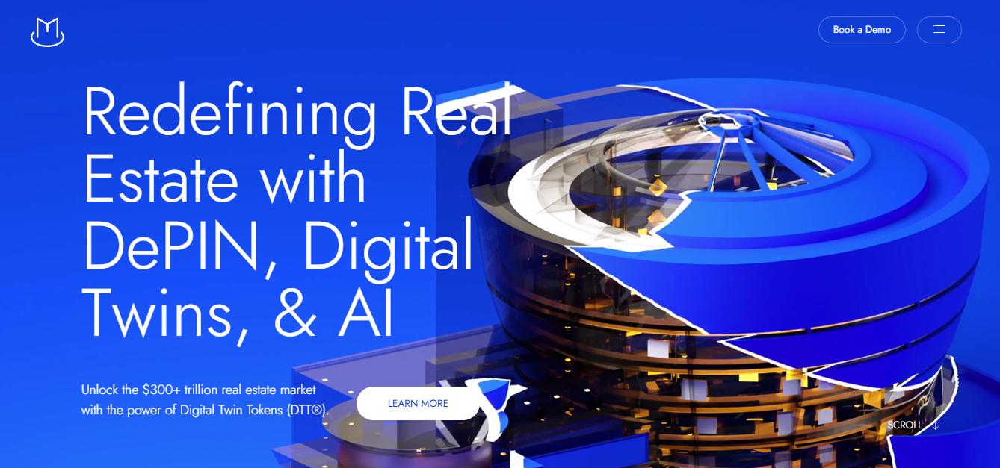

# 🔵 Magma Recreate – Real Estate Website UI

A high-fidelity **recreation of [thisismagma.com](https://thisismagma.com)** — built with cutting-edge animations and smooth scroll magic! ✨  
This project showcases a modern real estate web design with buttery-smooth user experience using JavaScript wizardry.

## 🔥 Features

- 🎨 Sleek UI inspired by Magma – a modern real estate brand
- 🧠 **GSAP** + **ScrollTrigger** – top-tier animation control
- 🌀 **Locomotive Scroll** – smooth scroll & parallax effects
- 🖼️ **Canvas animations** – visual effects that pop
- ⚡ Lightweight, responsive & smooth
- 💻 Built with HTML, CSS & JavaScript (vanilla + libraries)

## 🚀 Tech Stack

- HTML5 / CSS3
- JavaScript (ES6+)
- GSAP (GreenSock)
- ScrollTrigger
- Locomotive Scroll
- Canvas

## 🛠️ Setup & Run Locally

```bash
# Clone the repo
git clone https://github.com/Sanket3yoProgrammer/Magmaitis.git

# Go into the project folder
cd magma-recreate

# Open index.html in your browser
```

> No build tools needed – it's pure front-end magic 🪄

## 📸 Screenshots

Here are some previews of the UI:

  

> Scroll Animations


## 🌐 Live Demo

Check it out live 👉 [https://magmaitis.vercel.app/](https://magmaitis.vercel.app/)

## 📄 License

Free to explore & learn.  
If you use parts of this, give a shout-out! 🙌

---

Built with ❤️ by [@sanketyoprogrammer](https://github.com/sanketyoprogrammer)

